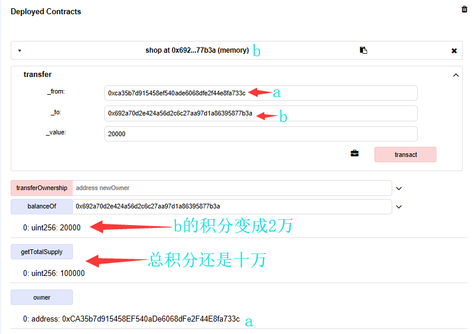
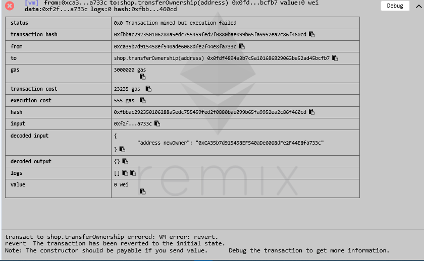

# day2  作业报告 -- 石望华

------

## 1. 作业内容

1. 用僵尸游戏熟悉solidity规则 https://cryptozombies.io/en/lesson
2. 课堂实验
3. 使用spring-boot-starter部署课上的LAG积分合约https://github.com/FISCO-BCOS/spring-boot-starter/blob/master/doc/README_CN.md

## 2. 

# 3. remix - 测试

### 3.1 查询

* 设有不同的四个地址a,b,c,d（对应remix中的四个Account）

* 用a Deploy shop合约，设置构造函数的参数（积分为十万），点击transact，得到一个shop1，地址在memory中的b，其所有者（owner）是a，其积分总数是调用构造函数时传入的参数

* 用a再次部署一次shop 合约（积分为二十万），得到一个地址在内存中的c的shop2，**其owner还是a**

* 调用balanceOf函数，发现在shop1中调用balanceOf函数，传入a地址，得到十万，而在shop2中传入a地址，**得到二十万**！说明两个shop下的两个映射是不同的，同一个地址下映射到两个积分值；另外，在两个shop的balanceOf里都传入b、c时，得到的四个值**都是0**！

* 以上测试截图记录如下：

  

### 3.2 转账

* 在shop1调用transfer函数，从a转20000到b，得到a的balance是8万，b的balance是2万，记录如下：

* 在shop2内从a转40000到c，得到a的积分为16万，c的积分为4万；再在shop2内从c转5000到地址b，得到c剩下35000，而b是5000，这里的b是**shop2内的b**！与shop1内地址b是不同的！这里不再截图。

### 3.3 当前结论

* 用地址a Deploy 一个shop合约后（即transact，调用一次构造函数），得到一个shop和一个用户地址b
* 在这个shop内部记录了a的balance和内部所有其他地址（不需要显示的声明！）的balance，店主a和消费者b一样，都看成一种账户类型，只是a的初始balance值不为0，b的balance值为0
* 每次调用一次构造函数得到一个不同的shop，如果用同一个地址a调用的构造函数，则表示a有两个shops，每个shop内各自记录a在这个shop里的balance

### 3.4 转换shop所有权

* 调用transferOwnership出现错误：

